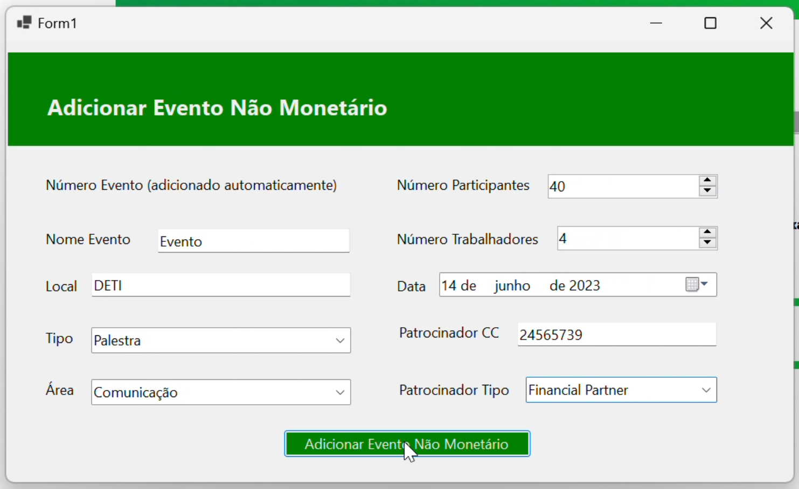

# Projeto Final de Base de Dados - Gestão de Núcleos<br />
#### Realizador po Diogo Falcão (108712) e Matilde Teixeira (108193)
<br />


## Intro
O projeto por nós desenolvido foi um Sistema de Gestão de Núcleos: Este assente numa base de dados com diversas entidades e uma interface apelativa pretendia que a gestão de eventos por parte de um núcleo fosse facilitada. Assim, a partir deste conseguiriamos adicionar Eventos e Eventos Não Monetários (com Sponsor), Gerir os Trabalhadores (Adicionar, Eleminar e Editar), Pulseiras, método do núcleo ter lucro por Eventos, cada produto comprado dá direito a uma pulseira (Adicionar x pulseiras e Ver por evento quantas foram vendidas) e um Armazém (Ver produtos consoante Comida e Bebida e Adicionar Produtos).
O nosso trabalho encontra-se estratificado da seguinte forma, Video.zip que contem o video de demonstração da interface, um zip, GestaoNucleos.zip, um zip com os ficheiros utilizados na interface, uma pasta Relatorio com o relatorio e outra SQL_Code com o codigo SQL, contendo Indexes, Inserções, Procedures, Tables, Triggers, UDFs e Views.
<br />
<br />

## Modificações desde a apresentação
Após recebermos a opinião do professor durante a APF-E, decidimos realizar alterações no trabalho com base em suas sugestões. Uma das principais mudanças foi na introdução de eventos não monetários na base de dados. Para evitar conflitos de ID e simplificar o processo de inserção, agora, o utilizador não precisa de inserir manualmente o ID do evento ao criar um novo Evento Monetário. 

Essa solução trouxe as seguintes vantagens:
- Evita conflitos de ID: A atribuição automática do ID do evento pela base de dados elimina duplicações e conflitos entre registos.
- Simplifica a inserção de eventos: Os utilizadores passam a não necessitar de fornecer o número de ID, tornando o processo mais intuitivo e menos propenso a erros.
- Aumenta a eficiência: A automatização da atribuição do ID reduz a carga de trabalho e otimiza o processo de inserção na base de dados.

Código:
```txt
-- adicionar evento monetario
CREATE PROCEDURE [dbo].[AddEventoMonetario] 
  @numero int, 
  @nome varchar(128), 
  @local varchar(64), 
  @tipo varchar(64), 
  @n_participantes int, 
  @n_trabalhadores int, 
  @area varchar(64), 
  @data datetime, 
  @lucro decimal(18, 2) 
AS
BEGIN
  BEGIN TRY
    DECLARE  @codigo_ev_mon varchar(64);
    DECLARE @random_number float;
    
    -- Inserir na tabela GestaoNucleos.Eventos
    INSERT INTO GestaoNucleos.Eventos(numero, nome, local, tipo, n_participantes, n_trabalhadores, area, data)
    VALUES (@numero, @nome, @local, @tipo, @n_participantes, @n_trabalhadores, @area, @data);
    
    -- Verificar se o número de evento existe na tabela GestaoNucleos.Eventos
    IF EXISTS (SELECT 1 FROM GestaoNucleos.Eventos WHERE numero = @numero)
    BEGIN
      -- Inserir na tabela GestaoNucleos.EventosMonetarios
      SET @random_number = RAND();
      SET @codigo_ev_mon = ROUND((@random_number * 900) + 100, 0);
      
      INSERT INTO GestaoNucleos.EventosMonetarios(numero, lucro, codigo_ev_mon)
      VALUES (@numero, @lucro, @codigo_ev_mon);
      
    END
    ELSE
    BEGIN
      -- Código de tratamento quando o número de evento não existe na tabela GestaoNucleos.Eventos
      RAISERROR('O número de evento fornecido não existe na tabela GestaoNucleos.Eventos.', 16, 1);
    END;
  END TRY
  BEGIN CATCH
    DECLARE @ErrorMessage NVARCHAR(4000);
    SET @ErrorMessage = ERROR_MESSAGE();
    RAISERROR(@ErrorMessage, 16, 1);
    SELECT ERROR_MESSAGE() AS ErrorMessage;
  END CATCH;
END;
```
Exemplo:

<br />
<br />


## O que não está na interface
Aqui
